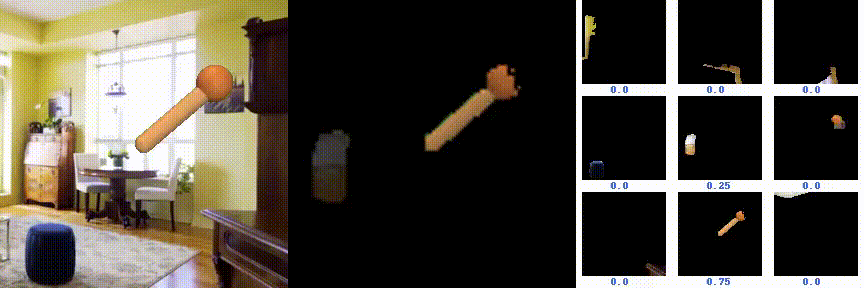

# Focus-Then-Decide: Segmentation-Assisted Reinforcement Learning #

This respiratory contains the code for AAAI-2024 accepted paper: Focus-Then-Decide: Segmentation-Assisted Reinforcement Learning

[**Project page**](https://www.lamda.nju.edu.cn/chenc/FTD.html) &nbsp;&nbsp;&nbsp;[**Paper**]()

## Installation ##

You can directly install the dependencies using the provided `setup.sh` file.

```sh
./setup.sh
```

## Run ##

Below are running commands of running FTD. Please replace *env* and *task* with corresponding arguments 
(e.g. ./scripts/run.sh franka reach). 

```sh
./scripts/run.sh env task
```

If everything goes well, this should yield an output of the form
```
Working directory: logs/franka_reach/ftd/20231228-170531
Observation space: (81, 84, 84)
Action space: (8,)
=====Start training=====
Evaluating: logs/franka_reach/ftd/20231228-170531
| eval | S: 0 | ERTEST: 1.8151e+01
| train | E: 1 | S: 250 | D: 93.8 s | R: 0.0000e+00 | ALOSS: 0.0000e+00 | CLOSS: 0.0000e+00 | RPredLOSS: 0.0000e+00 | APredLOSS: 0.0000e+00
| train | E: 2 | S: 500 | D: 98.4 s | R: 8.2735e+00 | ALOSS: 0.0000e+00 | CLOSS: 0.0000e+00 | RPredLOSS: 0.0000e+00 | APredLOSS: 0.0000e+00
```

To run the ablation study, please refer to `./scripts/run_ablation.sh`

For more parameter settings, please refer to `arguments.py`.

If you encounter problems related to rendering, please refer to respiratory of 
[DMC](https://github.com/google-deepmind/dm_control)

## Visualization
<div style="display: flex; justify-content: center;">
    <div style="flex: 0 0 33%; text-align: center;">
        <figure>
            
            <figcaption>pendulum-swingup</figcaption>
        </figure>
    </div>
    <div style="flex: 0 0 33%; text-align: center;">
        <figure>
            
            <figcaption>cartpole-swingup</figcaption>
        </figure>
    </div>
    <div style="flex: 0 0 33%; text-align: center;">
        <figure>
            
            <figcaption>finger-spin</figcaption>
        </figure>
    </div>
</div>

<div style="display: flex; justify-content: center;">
    <div style="flex: 0 0 33%; text-align: center;">
        <figure>
            
            <figcaption>hopper-stand</figcaption>
        </figure>
    </div>
    <div style="flex: 0 0 33%; text-align: center;">
        <figure>
            
            <figcaption>hopper-hop</figcaption>
        </figure>
    </div>
    <div style="flex: 0 0 33%; text-align: center;">
        <figure>
            
            <figcaption>cheetah-run</figcaption>
        </figure>
    </div>
</div>

<div style="display: flex; justify-content: center;">
    <div style="flex: 0 0 33%; text-align: center;">
        <figure>
            
            <figcaption>walker-walk</figcaption>
        </figure>
    </div>
    <div style="flex: 0 0 33%; text-align: center;">
        <figure>
            
            <figcaption>walker-run</figcaption>
        </figure>
    </div>
    <div style="flex: 0 0 33%; text-align: center;">
        <figure>
            
            <figcaption>franka-reach</figcaption>
        </figure>
    </div>
</div>

## Citation ##

If you find our work useful in your research, please consider citing our work as follows:
```
```